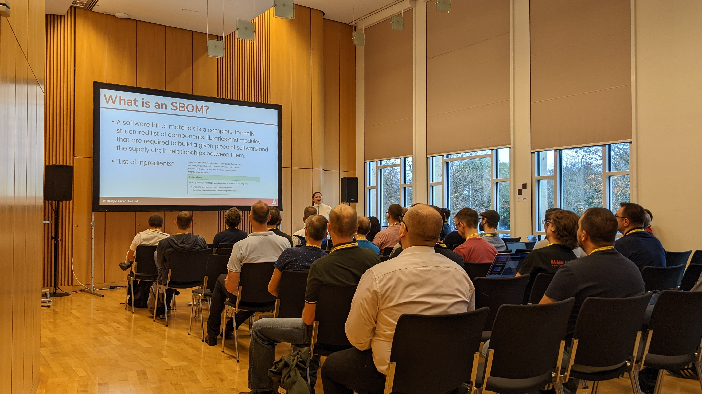

A month after EclipseCon. I, Carmen Delgado, Adoptium Community manager, want to share my experience attending the [EclipseCon 2022](https://www.eclipsecon.org/2022) edition in Ludwigsburg, Germany, from 24 to 27 October. It was my third week in the role, and this is how I documented the experience.

## Monday, the 24th: Community Day

On Monday, I had the opportunity to meet most of my Eclipse co-workers during our breakfast at the hotel. We had a morning session where Tim Ellison (Adoptium Working Group representative and PMC Lead), George Adams (Adoptium Chairman of the working group and PMC member), and Shelley Lambert (Adoptium Working Group member and PMC, and Eclipse board member) went through the Adoptium working group status and all the projects, and the community gave some feedback. You can view the presentation [here](Adoptium-Community-Day-EclipseCon2022.pdf).

_Tim, Shelley and George preparing Community day_

### A summary of

- **Adoptium Working Group**. Tim explained the main goals of the working group responsible for the governance of all projects and compliance with Eclipse processes. Their objective is not about making technical decisions. It is more about supporting the technical projects with the resources they require to be productive and successful, engaging with the broader Foundation, overseeing the governance of the projects' assets, and raising funds to support the projects' goals. For more information, review [Eclipse Adoptium Charter](https://www.eclipse.org/org/workinggroups/adoptium-charter.php).
- **[Adoptium marketplace](https://adoptium.net/marketplace/)**. launched in May 2022, the marketplace aims to raise the quality bar for OpenJDK builds available to the public from a variety of providers. It is open to working group members, and requires that participants meet high quality verification standards by passing the [AQAvit tests](https://adoptium.net/aqavit/). The marketplace re-directs users to the corresponding site where these high-quality binaries can be downloaded.
- **[Eclipse Temurin](https://adoptium.net/temurin/releases/)**. the flagship of the Adoptium projects, this brand name was created to separate our main product name from the Adoptium brand, and is an anagram of "RUNTIME". It is a well-tested Java SE binary available across multiple platforms. Consumable via [the Adoptium site](https://adoptium.net/temurin/releases/), [API](https://api.adoptium.net/), [packages](https://packages.adoptium.net/), [container images](https://hub.docker.com/_/eclipse-temurin), [installers](https://adoptium.net/temurin/releases/), and third-party redistributors. Signed for safe OS use and with a $ free-to-use open source license. According to our download metrics, we have over [300k downloads daily](https://dash.adoptium.net), but we don't track who is downloading (due to GDPR). Our premise is that if users need and make the case we will keep building it, but every time we release, we need more time and infra support to maintain all the versions. Some ideas we got from the community:
  - Be more clear about promoting the advantages of using Temurin and certifications, compliance, and licenses.
  - Define methods to notify the community of new releases and promote Temurin.
- **[AQAvit](https://adoptium.net/aqavit/)**. Adoptium's verification program offers tools and infrastructure to run a large pool of tests and analyze results, and it was created in collaboration with multiple vendors. The AQAvit project tests for quality, where quality criteria include functional correctness, performance, scalability, security, and robustness. At Adoptium, AQAvit is used to test the quality of Temurin, which is considered one of the largest distributions of OpenJDK Binaries. The next step for the AQAvit project is to get enterprise users involved. They can use the AQAvit framework and tools to add even more testing as part of their software supply chain or contribute tests to AQAvit directly. One value-add offered by AQAvit is that it allows us to test the binaries for consistency in their quality, go through the massive number of builds and generate summarized reports. As this project implies a lot of effort and infrastructure, we are looking for several kinds of collaboration: working with researchers to further automate and optimize execution and triage time and through sponsorship respectively.
- **[Temurin compliance](https://projects.eclipse.org/projects/adoptium.temurin-compliance)**. is responsible for obtaining, managing, and executing the Oracle Java SE Compatibility Kit (JCK) on Eclipse Temurin binaries. It is run as a non-open project and counts upon private infrastructure. The compliance project requires additional agreements in place for the community to participate.
- **[Eclipse mission control](https://adoptium.net/jmc/)**. Low-overhead monitoring and management of running Java applications. The idea is to get these services published as part of the Adoptium marketplace umbrella.
- **[Eclipse Adoptium Incubator](https://projects.eclipse.org/projects/adoptium.incubator)**. With this project, Adoptium is able to foster collaboration with a low threshold for setting up new projects. The main goal is to prompt innovation, allowing the community to explore ideas that may become full projects or wind-up after lessons have been learnt. Currently, we have a project about a [Fast Start-up](https://blog.adoptium.net/2022/10/a-short-exploration-of-java-class-pre-initialization/) with collaboration between Alibaba and Google.
- **[Migration toolkit for Java](https://projects.eclipse.org/projects/adoptium.emt4j)**. Most recent project to come to Adoptium, it helps manage some organizations' difficulties moving from Java 8 to Java 11+. The Alibaba team led the project as they wanted to share this tool.

### Focus Areas for 2023, Adoptium Working group has four pillars for 2023

- **Vibrant Healthy projects and Community**. Continue building a solid and healthy community. Attend events, and promote Adoptium.
- **Increase Product Usage**. Keep up with trends, and ensure we build what people need. Explain the real value of our products. We already have the “we produce high-quality binaries”. We want to show how these binaries are produced, talk with organizations, and ensure they understand the project's position.
- **Innovation that Matters**. Cover how we produce the projects, we can do a far better job and be more dynamic, as we have a big infrastructure to maintain. We want to generate collaborations with other Eclipse and influential projects beyond Eclipse.
- **Growing membership and involvement**. Participatory community, join the WG and bring your point of view. We need the voice of Java users and enterprises. It helps to bring additional funds and new opportunities, ensuring we have involvement from a wide variety of industries, have a robust community.

### Working Group and Community update

Here we showed some ideas and opened a discussion on how we can promote community, working group, and sponsorship:

- **New members**. We want to hear about Enterprise pain points and be sure how we add value to them. Reach out to industry decision-makers by doing B2B Marketing
- **Student programs**. We have collaborated with universities in the past. We are running the Outreachy program with two spaces: one funded by Eclipse and one by Red Hat.
- **More Events hosted by Adoptium**. Virtual conferences and being an active part of existing Java community events. This is a line of direct sponsorship as well.
- **Adopter page**. We could have an adopter page on our site for all users. It doesn’t matter if they belong to Eclipse Adoptium WG.

### Adoptium Site

Hosted and maintained by the community and Eclipse Foundation team. It was developed in a very open way and translated into various languages. For 2023, we want to ensure that it helps us achieve our focus areas and promotes our initiatives very easily, according to the audience profile.

### Adoptium Infrastructure

The current infrastructure is composed of 300+ machines. The team is working on Infrastructure as code, as we rely on vendor collaborations and sponsorship. In this area, we need to be leaner and more efficient. The highest usage of machines is during release time, which happens every three months. Our technical project management team is looking for collaborations in this area, as Adoptium is always looking to adopt best practices in the industry.

### Reproducible builds

An important part of the software supply chain security. Currently, Temurin is compliant with SLSA level 2, and as part of the 2023 plan, we want to achieve level 4. This includes a number of requirements including having SBOM implemented (Software bill of materials) and forms part of Adoptium's [secure software development](https://adoptium.net/en-GB/docs/secure-software/) initiative.

## Tuesday, the 25th: Eclipse Adoptium and OpenJDK Panel and Videos recording

Again, our community representatives, Tim, George, and Shelley, together with Jan Westerkamp and myself as the community manager held a 35-minute open panel to talk with EclipseCon attendees by summarising all our main projects and explaining the 2023 plan. It was an excellent opportunity to hear from enterprise users about how and why they use Temurin over other distributions and get some ideas to keep people informed about project updates. We want to thank all the attendees!

_Tim, Shelley, Jan and George hosting Eclipse Adoptium panel_

We also used this day to record videos about Eclipse Adoptium 2023 plan and promote our main projects. Stay tuned to watch them. We thank the Jakarta EE working group for sharing this recording space.

## Wednesday 25: How I Learned to Stop Worrying and Love the SBOM - by Shelley Lambert and Jakarta EE reception sponsored by IBM

In the morning, Shelley gave a talk explaining how Eclipse Adoptium is implementing SBOM (Software bill of materials) and why. Considering the audience, we realized it is a topic of interest as it is also linked to Eclipse foundation's goals for 2023 of achieving a security supply chain for all their projects.

_Shelley explaining what is an SBOM_

The day closed with the Jakarta EE reception sponsored by IBM, and they invited me to give some words on behalf of the community we represented. It was also a good moment to meet other sponsors and working group members.

_Carmen giving a thank you toast to both Jakarta EE and IBM team_

## Thursday 26: Closure and Hackathon

We had an opportunity to coordinate some strategic meetings with different Eclipse Foundation and Adoptium team members.

I can tell. It is a very tiring experience to be new at a conference hosted by the company you work with. Still, it was an excellent opportunity to catch up with my colleagues and understand many of the projects' how and why.
Looking forward to meeting again in 2023. In the meantime, feel free to join our Community channel in our [Slack space](https://adoptium.net/slack/).
