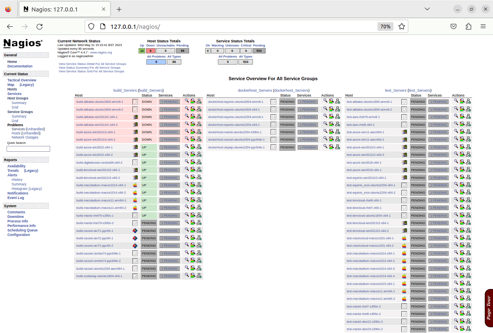
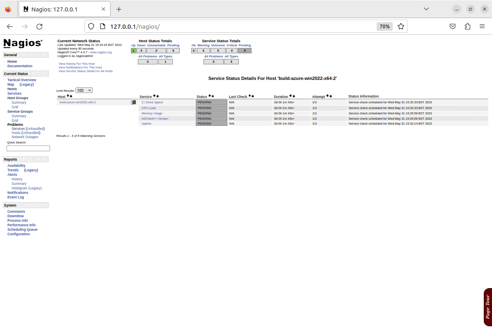

## 1. Introduction

The Adoptium project utilises the [Nagios Core](https://www.nagios.org/projects/nagios-core/) product to monitor the infrastructure that is used to provide services to the project. In order to maintain our Nagios monitoring solution an infrastructure-as-code solution has been developed to work alongside our current Ansible and GitHub based inventory management.

As part of a drive to improve automation, and revitalise the Nagios server, a project was undertaken with the aid of an [Outreachy](https://www.outreachy.org/) intern. The [Outreachy](https://www.outreachy.org/) organisation provides internships in open source and open science to people subject to systemic bias and impacted by underrepresentation in the technical industry where they are living.

The aim of this project was to improve the coverage and resilience of the Nagios service, and improve the ability to maintain it going forward. The main goals were to have a consistent way to create/recover a Nagios server, and also to improve the process for adding new hosts. There is a project wiki page, which has more details, about the project which can be found [here](https://github.com/adoptium/infrastructure/wiki/Outreachy:-Open-Infrastructure-Monitoring-Configuration:-Project-MonCon)

This blog post will cover how the project utilised Ansible and GitHub to deploy and maintain the Nagios monitoring solution.

These are the key areas covered in this blog:

- Adoptium infrastructure management
- Deployment of Nagios plugins & monitoring agents on hosts.
- Setup & configuration of a new Nagios server instance

There is also previous blog post which provides an overview of how the Nagios solution monitors the infrastructure here: [Adoptium Infrastructure Management With Nagios](https://adoptium.net/blog/2023/03/adoptium-infrastructure-management-with-nagios/).

In addition to the prior blog post, there is a YouTube video [Automated Nagios Deployment Using Ansible at Adoptium](https://www.youtube.com/watch?v=XDHsK1UT58w), which has a live demonstration of the process detailed in this blog post, available on the [Adoptium YouTube channel](https://www.youtube.com/@EclipseAdoptium).

## 2. Adoptium Infrastructure Management

The Adoptium project utilises a combination of Ansible and GitHub to help maintain and manage a consistent configuration across the large number of servers in use by the project. All of the elements detailed below, are stored within the [Adoptium Infrastructure GitHub Repository](https://GitHub.com/adoptium/infrastructure/), alongside relevant documentation. The key elements are:

Ansible: Ansible is an open-source automation tool that allows you to manage and configure systems. In the context of the Adoptium project, Ansible is used to automate the provisioning and configuration of servers and other infrastructure components.

Inventory Management: Ansible uses an inventory file that contains information about the hosts and groups of hosts that need to be managed. The [Adoptium inventory file](https://raw.GitHubusercontent.com/adoptium/infrastructure/master/ansible/inventory.yml) defines the servers, their IP addresses, connection details, and other relevant information, for the servers in use.

Ansible Playbooks: Ansible playbooks are YAML files that contain a set of instructions, or tasks, to be executed on the managed hosts. These playbooks define the desired state of the infrastructure and automate the deployment and configuration tasks. These playbooks are run periodically both on new and existing hosts to maintain consistent configuration.

Continuous Integration/Continuous Deployment (CI/CD): Within the Adoptium infrastructure repository, GitHub actions are leveraged to test the changes made to Ansible playbooks prior to being merged into the main codebase. This occurs whenever a PR is created within the infrastructure repository. This automated testing prior to any deployment across the regular infrastructure, either automatically via AWX or manually when building out new hosts, allows a much greater degree of confidence in the playbooks, thus making the management of the Adoptium project's inventory more efficient. In addition to this, tools such as the VagrantPlayBook check facility within the [Adoptium Jenkins Server](https://ci.adoptium.net/) allow development and testing of any changes to the Ansible playbooks.

In summary, Ansible is used to automate infrastructure provisioning and configuration, while GitHub provides version control and collaboration capabilities for managing the Ansible playbooks and inventory files. This combination allows for efficient and streamlined management of the Adoptium project's inventory.

Useful Links:

- [Infrastructure Repository README](https://GitHub.com/adoptium/infrastructure/blob/master/README.md)
- [Ansible Inventory](https://raw.GitHubusercontent.com/adoptium/infrastructure/master/ansible/inventory.yml)

## 3. Demonstration of the Nagios server installation playbooks

The below screen recording shows a typical run of the playbook used to build out the Nagios Server, the documentation in the infrastructure repository has a more detailed guide on how to do this, but other than the steps to configure secret elements such as the Nagios admin user password , slack URL, and elements like ssh keys, its a very straightforward process...

Once the playbook has completed, there will be a running Nagios server, and it will have configured the basic set of checks for the Nagios server itself, these elements can all be seen in the screenshots below:

 |

## 4. Demonstration of the Nagios configuration playbook

The below screen recording shows a typical run of the playbook used to configure the Nagios Server, it creates configuration based on the [Adoptium Ansible inventory file](https://raw.GitHubusercontent.com/adoptium/infrastructure/master/ansible/inventory.yml). The Nagios configuration playbook documentation in the infrastructure repository has a more detailed guide on how this functions, and how to customise its behaviour.

Once the run of the configuration of the playbook has completed, the configuration of service groups, hosts and checks will all be created, updated or amended based on the options configured, and the changes will be visible in Nagios as shown in the screenshots below.

N.B. This demonstration is being run on an x64 Ubuntu 22.04 virtual machine, which is running in isolation from the production infrastructure. As such it is prevented from actually connecting to the public infrastructure to carry out any checks beyond a cursory "ping" test, and as shown in the last screenshots, most system checks fail, and this is expected behaviour for this demonstration.
