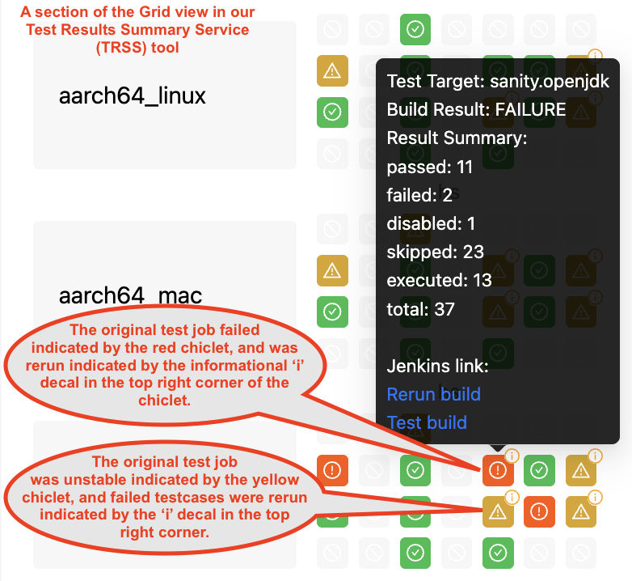

## What is AQAvit Again?

AQAvit is a project dedicated to quality assurance, verifying that OpenJDK binaries are production-ready and meet a stringent quality bar, including good performance, exceptional security, resilience, and the ability to pass a wide variety of application test suites and a broad set of workloads in diverse environments.

The [AQAvit project](https://projects.eclipse.org/projects/adoptium.aqavit) exists not only to test Temurin binaries but offers a useful test suite, tools, and processes that all OpenJDK distributors can utilize and can contribute towards.

## Recent Innovations in AQAvit

The small but mighty team of contributors that work on AQAvit features continues to deliver valuable features and improvements.  The first quarter of 2025 was no exception and we will look at a few of the most interesting and impactful contributions, and why they are considered so important.

### Automated Re-Runs

Auto-retry features for failed and unstable test pipelines now automatically re-execute failed test cases, significantly reducing human effort and machine time.

Jobs that report as failed are those that 'fall over' and can not even complete.  By the automated rerun feature, they are recognized by their parent job and relaunched.   During a release, this task was previously done manually and not immediately, as it would take time for people to see that jobs had failed.

Jobs that report as unstable are those that are able to complete, but have testcases that fail.  The automated rerun adds the ability for the jobs themselves to discern which test targets and testcases failed, and rerun only those failing testcases.  This specificity means that instead of rerunning the entire job or test target, which can take hours, only the failed testcases are retried, which typically takes only minutes.

### Change-Based Testing (CBT) - Phase 1

Changed-based testing enables smarter testing by executing only the tests relevant to changed code areas. This cuts resource usage without sacrificing test coverage and quality.

Phase 1 of this feature is relatively 'crude', but still useful.  It identifies what changes have happened in the upstream repository between the tag of the current build under test and the tag of the previous release.  Upon setting search strings, typically directory paths, the automation can warn the user that certain packages have changed.  We can then correlate those directories with test targets and make decisions about what targets should be run, and which test targets to de-prioritize.

As we move forward with the Change-based testing approach, we intend to become more sophisticated in how we correlate the changes to the testcases that are run against the codebase.  In phase 2, code coverage information will give a more precise correlation between code changes and test material.  We hope to begin Phase 2 later in 2025.  

### Improved Test Traceability & Reproducibility

In keeping with Adoptium's commitment to secure software development and AQAvit's commitment to support rapid development, we have expanded support for reproducible testing through better SHA tracking and test material versioning.  Many people already know that Temurin by Adoptium is [already fully reproducible](https://adoptium.net/blog/2024/08/adoptium-reproducible-verification-builds/), but why would we want to also create a fully reproducible test environment?

By capturing the SHAs of all test material in use during a test run, and specifying or capturing which versions of test dependencies are in use, we dramatically decrease the amount of time spent triaging particular failures.  We store these details in result artifacts to allow easy comparison of the material in use between a passing and failing test run.  Triagers and developers can hone in on which aspects have changed to identify possible issues that may have introduced a failure.

While we have had aspects of this functionality in place for some time, we have expanded the approach to find any test material in the workspace, including undeclared test material, and list it in the TAP file along with the declared material.

Improved traceability supports development work by helping identify rare, hard-to-replicate bugs and also allows for investigations to take place well after the failure was seen, since the SHAs can be fed back into the test pipelines weeks and months later to reproduce the same environment as the day a failure occured.  This rigorous and disciplined approach is a major boost for long-term test reliability, traceability, and secure supply chains.

### Performance Benchmarking Enhancements

We introduced interleaved benchmark testing and configurable visual indicators (“traffic lights”) to help detect regressions more accurately and quickly.  This work shifts us into the next phase of performance testing at AQAvit.  We run 80+ benchmarks at the project, currently to ensure that they can run.  We have pinned these runs onto particular machines and have been gathering performance data over the past years worth of releases.  

By the introduction of "traffic lights" and the ability to interleave baseline and test JDK runs, we have a greater ability to identify performance regressions and pinpoint them to particular changes in the codebase.  Performance test results can now become 'blockers' to releases until the root causes of regressions are identified.

Later in 2025, we intend to host a team of students as part of Semester of Code that will progress this work to develop a more adaptive approach to performance testing.

## Data-driven Decisions

As per the original [AQAvit manifesto](https://github.com/adoptium/aqa-tests/blob/master/docs/pages/Manifesto.md), we continue to gather meaningful data to improve the AQAvit project and measure the value of our work.  These metrics drive decisions in the project.

In a recent example, we started gathering information during release periods on how many 'human interventions' were required either when unexpected testcase failures occurred or in the event of infrastructure issues.  While anectdotally we knew that we were spending too much time 'nudging' test pipelines along, seeing that it was adding hours of extra triage time and delaying releases by days was humbling.  With the new auto-rerun features, we radically reduce the effort required to triage our test pipelines.

### GUI Test Automation

Leveraging Amazon’s open-sourced [Arctic](https://github.com/corretto/arctic) tool, manual GUI testing can now automated.  We have been actively engaging in automating GUI tests from the OpenJDK project (within the AQAvit project) and the interactive tests from the Technology Compatibility Kit (TCK) provided through the OCTLA (within the Temurin-Compliance project).

We have been capturing what we have learned in this [Arctic Project Guide](https://github.com/adoptium/aqa-tests/wiki/Arctic-Project-Guide) and this detailed instruction for [Setting up Arctic Recording and Playback in Jenkins](https://github.com/adoptium/aqa-tests/wiki/Arctic-%E2%80%90-Recording-&-Playback-setup-for-Jenkins-execution-in-Xvfb).  The intent is to commit our documentation to the Arctic repository, along with any other enhancements to the tool that may be useful, once our work is completed.

We must emphatically thank David Alvarez for creating Arctic and the team at Amazon (Volker, Elif, and Dave) for open-sourcing this valuable tool, continuing to improve upon it, walking us through common workflows, and answering our eager questions.  They have made a very impactful open-source contribution and it is hugely appreciated.

## Looking Forward to the Remainder of 2025

With the full acknowledgment that plans change and shift as time ticks forward, there is still interesting work planned for the last half of 2025.

### AI-Powered Tooling via GSoC

As per the AQAvit manifesto, we are committed to innovation and finding new ways of doing things.  Our ongoing commitment includes research and implementation trials for 2 projects, [CommitHunter](https://gitlab.eclipse.org/eclipsefdn/emo-team/gsoc-at-the-ef/-/issues/11) (AI-based commit debugger) and [GlitchWitcher](https://gitlab.eclipse.org/eclipsefdn/emo-team/gsoc-at-the-ef/-/issues/12) (AI bug predictor).  These projects will be developed through Google Summer of Code collaborations.

### Open-source Program Participation

As mentioned earlier, AQAvit actively seeks new contributions by participating in open-source programs like Google Summer of Code and Semesters of Code.  We will be participating in both programs in 2025.  

The AQAvit committers mentor new contributors to bring in new features, reduce technical debt, and generally improve the state of the project.  We look forward to the enthusiasm and creativity of new contributors and are motivated by what can be accomplished together.

### Trestle Initiative

The [Trestle initiative](https://github.com/adoptium/ci-jenkins-pipelines/wiki/Trestle-Initiative) has had stops and starts due to a number of external factors, essentially boiling down to constrained time and money.  This initiative bridges the upstream OpenJDK project with Adoptium’s broad testing infrastructure for major feature validation.  

We intend to make our infrastructure available for testing new OpenJDK features before they are merged upstream.  While we know there is a certain amount of PR testing that occurs, the set of platforms available are limited.  We have already begun running Trestle pipelines at the project, but hope to continue beta testing with OpenJDK developers employed by companies who are members of the Adoptium Working group, measure the impact on our test infrastructure, and monitor the trials.  This ultimately connects developers with architectures they may not have access to otherwise, gives flexibility on the set of tests that are run against a new feature, and reduces the number of defects that may fall through the gaps.

Special thanks for the entire team at SAP, for hosting a visit and conversation on best practices with regards to testing commits and navigating test results.  The discussion helps prioritize our next steps on improving TRSS and allowing more granular views into testcase failures.  Hopefully the remainder of 2025 will be as productive as its dynamic start.
