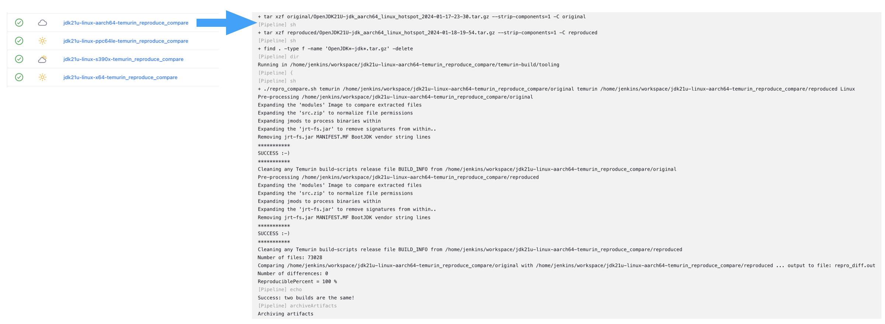

Adoptium is happy to announce the immediate availability of Eclipse Temurin 8u402, 11.0.22, 17.0.10 and 21.0.2. As always, all binaries are thoroughly tested and available free of charge without usage restrictions on a wide range of platforms. Binaries, installers, and source code are available from the [Temurin download page](https://adoptium.net/temurin/releases), [official container images](https://hub.docker.com/_/eclipse-temurin) are available at DockerHub, and [installable packages](https://adoptium.net/installation/) are available for various operating systems.

## Security Vulerabilities Resolved

The following table summaries security vulnerabilities fixed in this release cycle. The affected Temurin version streams are noted by an 'X' in the table. Each line shows the [Common Vulnerabilities and Exposures (CVE) vulnerability database](https://nvd.nist.gov/vuln) reference and [Common Vulnerability Scoring System (CVSS) v3.1 base score](https://www.first.org/cvss/v3.1/specification-document) provided by the [OpenJDK Vulnerability Group](https://openjdk.org/groups/vulnerability/). Note that defense-in-depth issues are not assigned CVEs.

| CVE Identifier  | Component | CVSS Score | v8 | v11 | v17 | v21 |
| :---                                                              | :---                |  :----:      |  :----:   | :----:     | :----:     | :----:     |
| [CVE-2024-20932](https://nvd.nist.gov/vuln/detail/CVE-2024-20932) | security-libs/java.security    |  High ([7.5](https://nvd.nist.gov/vuln-metrics/cvss/v3-calculator?name=CVE-2024-20932&vector=AV:N/AC:L/PR:N/UI:N/S:U/C:N/I:H/A:N&version=3.1))  |           |            | X          |            |
| [CVE-2024-20918](https://nvd.nist.gov/vuln/detail/CVE-2024-20918) | hotspot/compiler    |  High ([7.4](https://nvd.nist.gov/vuln-metrics/cvss/v3-calculator?name=CVE-2024-20918&vector=AV:N/AC:H/PR:N/UI:N/S:U/C:H/I:H/A:N&version=3.1))   |     X      |      X      | X          | X          |
| [CVE-2024-20952](https://nvd.nist.gov/vuln/detail/CVE-2024-20952) | security-libs/java.security    |  High ([7.4](https://nvd.nist.gov/vuln-metrics/cvss/v3-calculator?name=CVE-2024-20952&vector=AV:N/AC:H/PR:N/UI:N/S:U/C:H/I:H/A:N&version=3.1))   |    X       |      X      | X          | X          |
| [CVE-2024-20926](https://nvd.nist.gov/vuln/detail/CVE-2024-20926) | core-libs/javax.script    | Medium ([5.9](https://nvd.nist.gov/vuln-metrics/cvss/v3-calculator?name=CVE-2024-20926&vector=AV:N/AC:H/PR:N/UI:N/S:U/C:H/I:N/A:N&version=3.1))    |      X     |       X     |           |            |
| [CVE-2024-20919](https://nvd.nist.gov/vuln/detail/CVE-2024-22919) | hotspot/runtime    |  Reserved (5.9)   |     X     |    X       | X          | X          |
| [CVE-2024-20921](https://nvd.nist.gov/vuln/detail/CVE-2024-20921) | hotspot/runtime    |  Reserved (5.9)   |     X     |    X       | X          | X          |
| [CVE-2024-20945](https://nvd.nist.gov/vuln/detail/CVE-2024-20945) | security-libs/javax.xml.crypto    | Reserved (4.7)   |     X     |    X       | X          | X          |

Users should follow the [Adoptium policy for reporting vulnerability concerns](https://github.com/adoptium/adoptium/security/policy#security-policies-and-procedures) with this release.

## Fixes and Updates

This release contains the following fixes and updates.

* [Temurin 8u402 release notes](https://adoptium.net/temurin/release-notes/?version=jdk8u402-b06), including [fixes in OpenJDK 8u402](https://bugs.openjdk.org/issues/?jql=project+%3D+JDK+AND+fixVersion+%3D+openjdk8u402)

* [Temurin 11.0.22 release notes](https://adoptium.net/temurin/release-notes/?version=jdk-11.0.22+7), including [fixes in OpenJDK 11.0.22](https://bugs.openjdk.org/issues/?jql=project+%3D+JDK+AND+fixVersion+%3D+11.0.22)

* [Temurin 17.0.10 release notes](https://adoptium.net/temurin/release-notes/?version=jdk-17.0.10+7), including [fixes in OpenJDK 17.0.10](https://bugs.openjdk.org/issues/?jql=project+%3D+JDK+AND+fixVersion+%3D+17.0.10)

* [Temurin 21.0.2 release notes](https://adoptium.net/temurin/release-notes/?version=jdk-21.0.2+13), including [fixes in OpenJDK 21.0.2](https://bugs.openjdk.org/issues/?jql=project+%3D+JDK+AND+fixVersion+%3D+21.0.2)

## New and Noteworthy

### No Temurin Arm 32-bit Linux binaries for JDK 21 and up

As per the Eclipse Adoptium PMC decision, the project will not produce Temurin binaries for Arm 32-bit Linux for JDK 21 and up.  This decision is based on several criteria, including download statistics, level of support for the platform in the upstream OpenJDK project and interest from Adoptium Working Group members.  

### Availability of s390x Linux and ppc64 AIX in JDK 21.0.2+13

We are pleased to announce the availability of these 2 platforms for JDK 21.0.2+13.  We were unable to release them during our October 2023 release period, so this is the first time that production-ready JDK 21 Temurin binaries have been published out of the project.

### aarch64 macOS Respin

Eclipse Temurin 11.0.22 aarch64 macOS binaries are in a separate release named jdk-11.0.22+7.1 due to a respin that was required to fix a [linking issue](https://github.com/adoptium/infrastructure/issues/3353) introduced in a compiler upgrade for that platform.

### ppc64 AIX JDK11 and JDK17 Unavailable

Temurin 11 and 17 on AIX remain unavailable due to an [issue with Harfbuzz](https://bugs.openjdk.org/browse/JDK-8313643).  Fortunately, an update to the version of Harfbuzz is targeted for April 2024.

### Refinements to SBOM Contents

As of this release, extra details relating to Windows and Mac compiler versions are being recorded in the Software Bill of Materials (SBOM) for those platforms (details can be found in temurin-build [PR 3606](https://github.com/adoptium/temurin-build/pull/3606)).

### Confirmation of Reproducible Builds for JDK 21 Temurin binaries

Now that we have created pipelines that verify the Temurin binaries we produce are reproducible, we have an effective way to confirm that this 'feature' does not regress.  As indicated in the diagram below, for all primary platforms on JDK 21.0.2+13, we confirm those binaries are reproducible.

### SLSA Level 3 for Majority of platforms

Since our previous release, we have been diligently been working at closing the last issues required for us to declare [SLSA Level 3 compliance for Linux and macOS Temurin binaries](https://adoptium.net/blog/2024/01/slsabuild3-temurin/).  This is a lauded accomplishment for the project, though our work is ongoing.  Our 2024 plan sees us continue to focus on secure development best practices.
